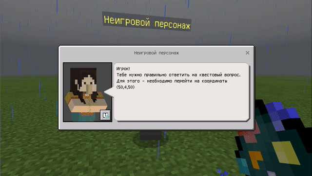
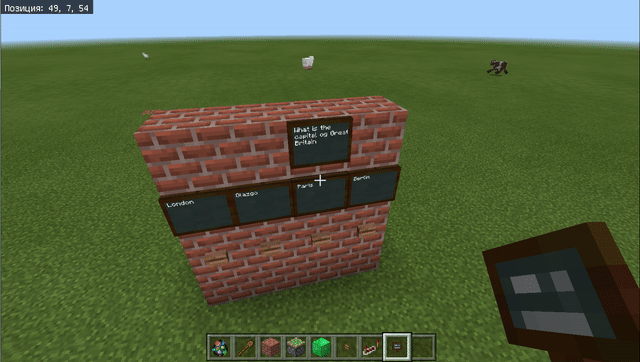
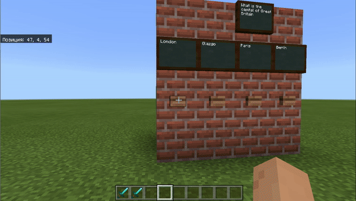

# Проект
## 1. Старт проекта
В начале проекта по команде чата **start** - телепортировать игрока в стартовую точку и вывести на экран информацию об игре. При этом при самостоятельной команде чата **about** также выводить информацию об игре.
  

### Несколько экранов информации
При необходимости вывода информации на более чем 1-м экране необходимо поставить задержку более чем 8000 мс.
  

  
  

## 2. Создание NPC
### Создание NPC
Добавляем неигровой персонаж
  

Меняем настройки мира (устанавливаем параметр World builder в значение true). Для этого в чате пишем команду 
`/wb`
  
  

### Настройка NPC
Кликнем правой клавишей мыши на созданного неигрового персонажа.
  
И войдем в настройки диалогового окна.
  
Введем текст, который будет сообщать NPC игроку при обращении к нему.
  

Для того, чтобы вернуться к стандартному режиму - заменим параметр world builder на false, введя в чат команду `/wb`  
  
  

При выключении режима изменения мира (world builder - false) при нажатии правой клавишей мыши на неигрового персонажа будет отображаться запланированный текст.
  
 Данный текст также можно включить на автоматическое чтение.
  

### 3. Квест
Необходимо создать механизм из кнопок, липких поршней и алмазных блоков
  
  
  
И добавить код, который фиксирует наличие алмазного блока в определенной позиции
  
В результате &mdash; получем под каждую кнопку &mdash; различный ответ.
  

<a href = "https://github.com/mikh-maksi/minecraft-code/blob/main/quest_questions.js">Код проверки вопросов</a>  

#### Игрок получает вещи
За различные ответы игроку можно выдавать различные вещи. Для этого - при различных ответах передавать игроку различные вещи:  
  

#### Телепортирование
Когда игрок дает правильный ответ - необходимо телепортировать его (либо в точку следующего вопроса, либо в точку начала RPG).
  

#### Обратный отсчет
Перед стартом RPG-части важно дать игроку время на то, чтобы он подготовился к атаке (взял желаемое оружие, одел амуницию).  
  
  
  
<a href = "https://github.com/mikh-maksi/minecraft-code/blob/main/time_back.js">JavaScript</a>  

  